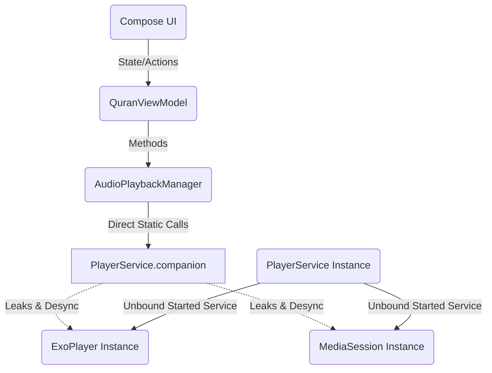
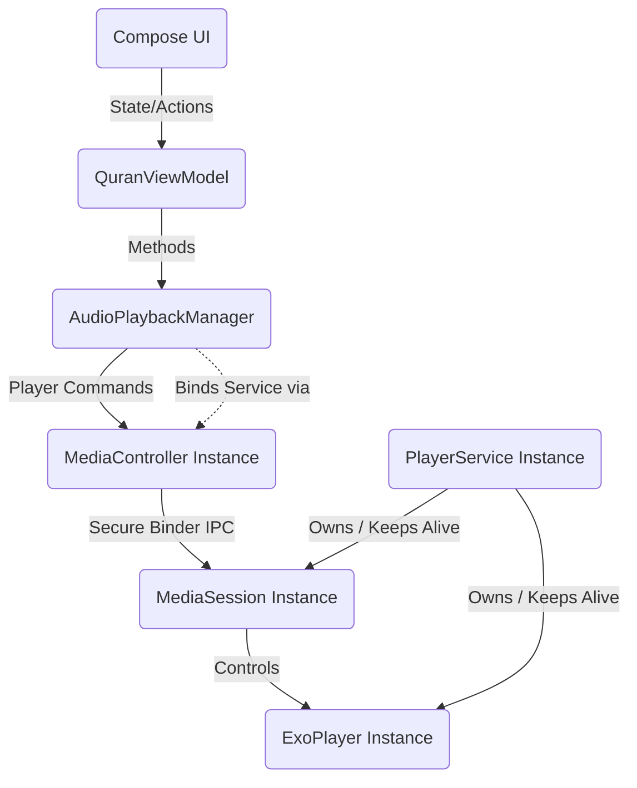

# Implementation Plan: Standard Media3 MediaController Architecture Integration

This plan details the refactoring required to fix **Critical Issue #1: "Bypassing Media3 MediaController Architecture"** in the Al-Minshawi Quran Player application. 

By removing the unsafe static references to `ExoPlayer` and `MediaSession` and introducing standard `MediaController` bindings, we will stabilize background playback, satisfy Android 13/14+ service requirements, and eliminate potential memory leaks.

## User Review Required

> [!IMPORTANT]
> This is a core architectural change modifying how the playback manager communicates with the ExoPlayer background service. No workarounds are being implemented; this is a proper migration to the official Android Media3 session/controller model.

## Proposed Changes

### Audio Playback Connection Layer

We will remove the static properties inside [PlayerService.kt](file:///e:/app/al-minshawi-quran/app/src/main/java/com/example/data/audio/PlayerService.kt) and update [AudioPlaybackManager.kt](file:///e:/app/al-minshawi-quran/app/src/main/java/com/example/data/audio/AudioPlaybackManager.kt) to bind to the player service asynchronously via the standard `MediaController` API.

---

#### [MODIFY] [PlayerService.kt](file:///e:/app/al-minshawi-quran/app/src/main/java/com/example/data/audio/PlayerService.kt)
- **Remove** the `companion object` declaration containing `var exoPlayer` and `var mediaSession` statics.
- **Add** private instance fields `private var exoPlayer: ExoPlayer? = null` and `private var mediaSession: MediaSession? = null`.
- **Remove** the direct application reference setup:
  ```kotlin
  // Remove this direct coupling
  val app = application as? QuranApplication
  app?.playbackManager?.setupPlayerListeners(player)
  ```
- **Update** `onGetSession` to return the instance's `mediaSession`.
- **Update** `onDestroy` to set instance variables to null rather than companion object variables.

---

#### [MODIFY] [AudioPlaybackManager.kt](file:///e:/app/al-minshawi-quran/app/src/main/java/com/example/data/audio/AudioPlaybackManager.kt)
- **Remove** properties mapping directly to `PlayerService.exoPlayer` and `PlayerService.mediaSession`.
- **Add** `private var mediaController: MediaController? = null` and a standard public `val exoPlayer: Player? get() = mediaController` property. (This ensures Compose components and ViewModel code, which interact with `playbackManager.exoPlayer`, continue to compile without modifications since `MediaController` implements the standard `Player` interface).
- **Refactor** `setupPlayerListeners` to accept a standard `Player` interface instead of the concrete `ExoPlayer` class.
- **Refactor** `initPlayer()` to construct and bind to the `MediaController` asynchronously:
  ```kotlin
  private fun initPlayer() {
      if (mediaController != null) return
      val sessionToken = SessionToken(applicationContext, ComponentName(applicationContext, PlayerService::class.java))
      val controllerFuture = MediaController.Builder(applicationContext, sessionToken).buildAsync()
      controllerFuture.addListener({
          try {
              val controller = controllerFuture.get()
              mediaController = controller
              setupPlayerListeners(controller)
              // Sync states
              ...
          } catch (e: Exception) {
              Log.e("DIAGNOSTICS", "Failed to connect MediaController", e)
          }
      }, Executor { command -> Handler(Looper.getMainLooper()).post(command) })
  }
  ```
- **Update** `release()` to release the `MediaController` instance:
  ```kotlin
  mediaController?.release()
  mediaController = null
  ```
- **Update** `playSurah()` wait loop to poll `mediaController == null` instead of `exoPlayer == null`.

---

## Architectural Flow Diagrams

### Before (Incorrect direct static reference)


### After (Standard MediaController Binding Pattern)


---

## Verification Plan

### Automated Verification
Run local Robolectric unit and UI tests to confirm that Compose rendering compiles and runs properly, and database queries/history logging continue to work as expected.
```bash
./gradlew test
```

### Manual Verification
1. Run the application on an Android 13/14 emulator or device.
2. Select a Surah to start audio playback.
3. Verify that the notification appears in the notification drawer with media control buttons.
4. Press the Home button to send the app to the background.
5. Verify that the audio continues to play in the background.
6. Lock the screen and verify that the audio does not stop.
7. Un-lock, open other apps (e.g., Settings, Browser) and confirm playback remains uninterrupted.
8. Swipe the main activity from recent tasks to verify that task swipe behavior survives (the service remains active and playing) and that pausing stops the service.
