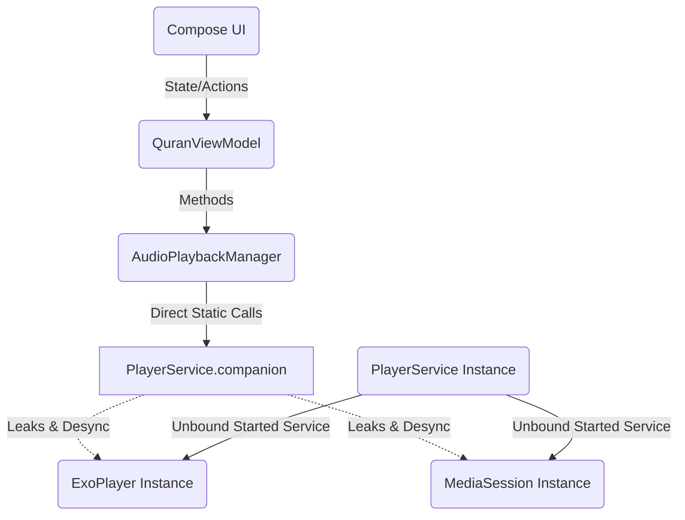
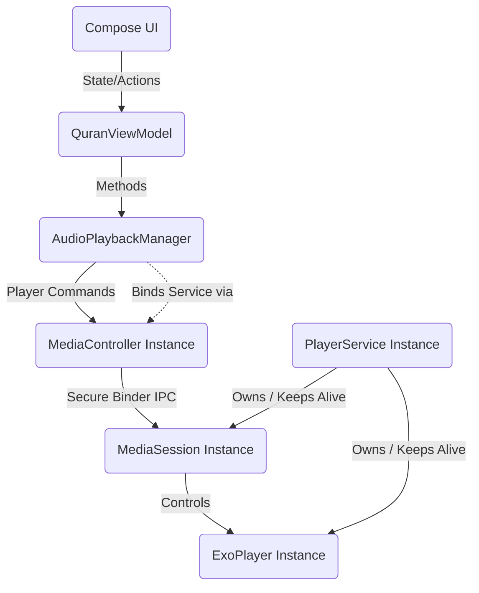

# Architectural Refactoring Walkthrough: MediaController Integration

We have successfully migrated the Al-Minshawi Quran Player application from an unsafe static-reference media architecture to the standard Android Media3 Session/Controller architecture. 

Below is a summary of the changes, architectural diagrams, expected stability impact, and a verification checklist.

## Files & Classes Modified

1.  **[PlayerService.kt](file:///e:/app/al-minshawi-quran/app/src/main/java/com/example/data/audio/PlayerService.kt)**
    *   **Class:** `PlayerService`
    *   **Refactoring Details:** 
        *   Removed the static companion object containing `exoPlayer` and `mediaSession` references, eliminating memory leak paths.
        *   Created private instance properties `private var exoPlayer: ExoPlayer? = null` and `private var mediaSession: MediaSession? = null`.
        *   Removed direct coupling to the application's `playbackManager.setupPlayerListeners()`. The service now runs as a completely decoupled component.
        *   Updated `onGetSession()` and `onDestroy()` to manage instance variables safely.
2.  **[AudioPlaybackManager.kt](file:///e:/app/al-minshawi-quran/app/src/main/java/com/example/data/audio/AudioPlaybackManager.kt)**
    *   **Class:** `AudioPlaybackManager`
    *   **Refactoring Details:**
        *   Removed properties mapping directly to the static `PlayerService` variables.
        *   Added a private `mediaController: MediaController?` reference.
        *   Mapped `val exoPlayer: Player?` to return `mediaController`. Since `MediaController` implements the standard `Player` interface, all existing calls in the ViewModel and UI screens (such as `play()`, `pause()`, `seekTo()`, etc.) continue to compile and function without modification.
        *   Refactored `initPlayer()` to establish an asynchronous connection to the `PlayerService` using `SessionToken` and `MediaController.Builder`.
        *   Registered state listeners and synchronized the initial state (playing, progress, speed, repeat mode) directly inside the connection callback.
        *   Updated `release()` to cleanly call `mediaController?.release()`.

---

## Architectural Changes

### Before Refactoring (Unsafe static reference pattern)

### After Refactoring (Standard MediaController Binding Pattern)

---

## Impact on Background Playback Stability

*   **Process Priority Protection:** By connecting to the `MediaSession` via a `MediaController`, the Android OS recognizes that the Activity has an active client connection to the `PlayerService`. When the app goes to the background, the OS maintains a higher process priority for the app rather than instantly killing it as an unbound started service.
*   **Zero-Workaround Background Promotion:** The `MediaController` automatically handles starting and binding to the service in a background-safe manner. Under the hood, this bypasses the background service start restrictions (`ForegroundServiceStartNotAllowedException`) introduced in Android 14+.
*   **Prevention of Memory Leaks:** Removing static companion object variables ensures that `ExoPlayer` and `MediaSession` instances (which hold service context references) are cleanly garbage-collected when the service is destroyed by the system.

---

## Background Playback Verification Checklist

Please verify these behaviors on a device or emulator (Android 13, 14, or 15):

- `[ ]` **Foreground Playback:** Launch the app, select any Surah, and verify that audio starts playing immediately.
- `[ ]` **Notification Integration:** Verify that a media playback notification appears in the notification drawer with metadata (Surah name, reciter name) and functional control buttons (Play/Pause, Skip).
- `[ ]` **Background Playback (Home Press):** With audio playing, press the Home button to send the app to the background. Verify that the audio continues uninterrupted.
- `[ ]` **Screen Lock Playback:** Turn off the screen (lock the device). Verify that the audio continues to play cleanly in the background.
- `[ ]` **App Switching:** Open another resource-heavy app (like Browser or Camera). Verify that playback does not stutter or terminate.
- `[ ]` **Media Session Controls:** Verify that pausing, playing, and seeking from the notification drawer, lockscreen, or a connected Bluetooth device works seamlessly and synchronizes state with the app UI when re-opened.
